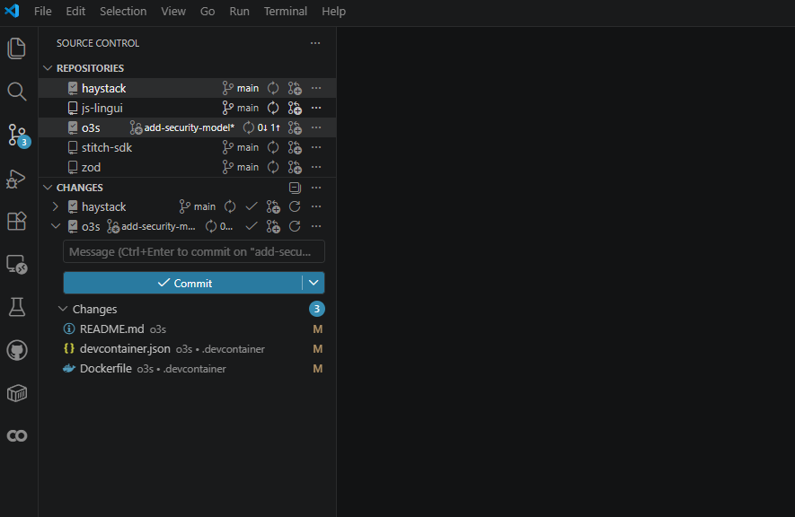

# O3S - Open Source Software Suite
A plug-and-play dev container that powers your development - built for AI agents, safe by design.



## Why O3S?

<table>
  <tr>
    <td width="50%" valign="top">
      <h3>🔌 Plug & Play</h3>
      <p>As AI coding agents become part of every workflow, the environment they run in matters as much as the code they write. Clone the repo, reopen in container - done.</p>
    </td>
    <td width="50%" valign="top">
      <h3>🛡️ Safe Agent Isolation</h3>
      <p>AI agents are powerful but probabilistic - they can and will make mistakes. The firewall doesn't care. It deterministically blocks any outbound traffic not on your allowlist, no matter what the model decided to do.</p>
    </td>
  </tr>
  <tr>
    <td width="50%" valign="top">
      <h3>🐳 Prototype to Production</h3>
      <p>Docker-in-Docker and Kubernetes built in. Don't hope your stack works in prod - spin it up, let your agent pen test it, and know before you ship.</p>
    </td>
    <td width="50%" valign="top">
      <h3>☁️ Free Cloud Compute</h3>
      <p>No GPU? No problem. Open a notebook and let Google Colab handle the heavy lifting - TPU-backed compute, for free, without leaving your workspace.</p>
    </td>
  </tr>
</table>

> [!TIP]
> Checkout the [Wiki](https://github.com/Hansehart/o3s/wiki) for more capabilities.

## Getting Started

### Prerequisites
- Install [Docker Engine/Desktop](https://docs.docker.com/engine/install/)
- Install [Visual Studio Code](https://code.visualstudio.com/download)
- Install the [Dev Containers extension](https://marketplace.visualstudio.com/items?itemName=ms-vscode-remote.remote-containers) in VS Code

### Setup
1. **Clone the repository**
   ```bash
   git clone git@github.com:Hansehart/o3s.git
   ```

2. **Open the folder in VS Code**
   - Press `Ctrl+Shift+P` / `Cmd+Shift+P` and select `Dev Containers: Reopen in Container`
   - The container builds automatically (first time takes a few moments)

3. **Start developing**
   - Your projects live in `/home/ubuntu/projects`
   - Press `Ctrl+Shift+P` / `Cmd+Shift+P` and use `File: Open Folder` to navigate there

> [!WARNING]
> Work inside `/home/ubuntu/projects` - your data will persist across sessions. Only work outside of it if you know what you are doing.
