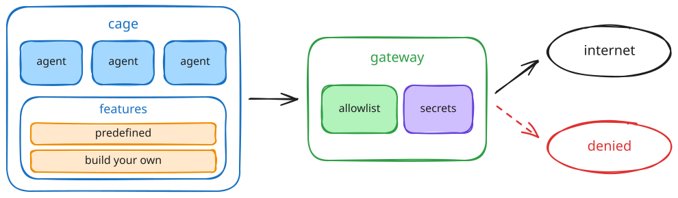
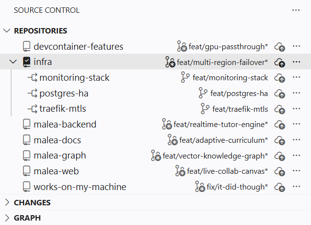
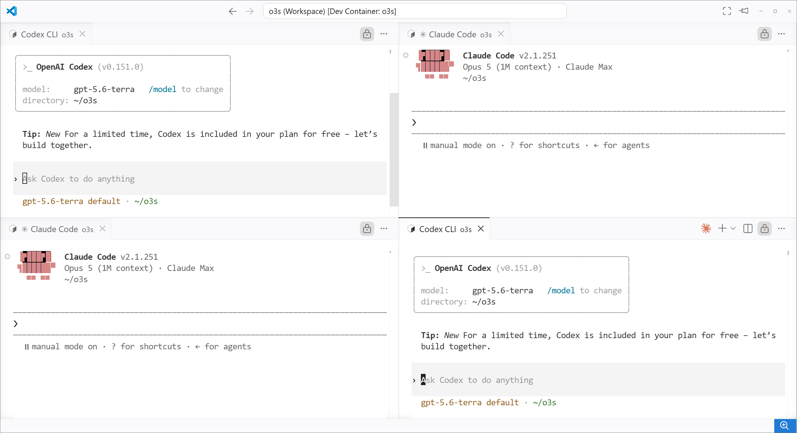

<p align="center">
  
</p>

<h1 align="center">o3s</h1>

<p align="center">
  <b>Everything ready. Everything parallel. Everything locked down.</b>
</p>

<p align="center">
  <picture>
    <source media="(prefers-color-scheme: dark)" srcset=".github/assets/architecture-dark.excalidraw.svg">
    
  </picture>
</p>

If you are not willing to trade security for productivity, o3s is a match. Let an agent generate every line of code, and review every line by hand or none at all - which hosts your agents reach, and which secrets they can read, stays yours to decide.

[Anthropic][ref] and [OpenAI][cdx] both ship a reference devcontainer, and both tell you to bring your own network controls. o3s is what that looks like when someone does: productivity on steroids, and deterministic enforcement to get there.

We do software development for a living, and o3s is our answer to keeping pace: several projects at once, and several features inside each. AI will not be the death of good engineering. Not here. This is how we build with it and still stand behind every line that ships.

## Security

You write the whole policy in one file, `config.toml`, one table per host:

```toml
["github.com"]
ports = [22, 443]

["api.anthropic.com"]
ports = [443]

["api.openai.com"]
ports  = [443]
secret = "OPENAI_API_KEY" # injected for this host only, never inside the cage
```

## Productivity

You list every project in one file, `o3s.code-workspace`, one folder per repository or worktree:

```json
"folders": [
  { "name": "devcontainer-features", "path": "/home/ubuntu/projects/devcontainer-features" },
  { "name": "infra",                 "path": "/home/ubuntu/projects/infra" },
  { "name": "infra.worktrees",       "path": "/home/ubuntu/projects/infra.worktrees" },
  { "name": "malea-backend",         "path": "/home/ubuntu/projects/malea-backend" },
  { "name": "malea-docs",            "path": "/home/ubuntu/projects/malea-docs" },
  { "name": "malea-graph",           "path": "/home/ubuntu/projects/malea-graph" },
  { "name": "malea-web",             "path": "/home/ubuntu/projects/malea-web" },
  { "name": "works-on-my-machine",   "path": "/home/ubuntu/projects/works-on-my-machine" }
]
```

Open it and every repository lands in one source-control view, worktrees nested under the repository they came from:

<p align="center">
  <picture>
    <source media="(prefers-color-scheme: dark)" srcset=".github/assets/workspace-dark.png">
    
  </picture>
</p>

Run whatever agent you like, several at once, each on its own branch. They work in parallel without colliding, and everything lands in one place for you to review.

<p align="center">
  <picture>
    <source media="(prefers-color-scheme: dark)" srcset=".github/assets/agents-dark.png">
    
  </picture>
</p>

## Iteration

Rootless Docker and minikube can run inside the sandbox, so an agent can stand up your whole stack, break it, and stand it up again without touching anything real. Two things have to hold: the infrastructure has to behave like production, and the loop from failure to next attempt has to be short.

## Getting started

**Prerequisites:** [Docker](https://docs.docker.com/engine/install/), [VS Code](https://code.visualstudio.com/download), and the [Dev Containers extension](https://marketplace.visualstudio.com/items?itemName=ms-vscode-remote.remote-containers).

1. Clone the repo.
   ```bash
   git clone https://github.com/Hansehart/o3s.git
   ```
2. Open it in VS Code and run `Dev Containers: Reopen in Container`.
3. Open `.devcontainer/o3s.code-workspace` and keep your projects in `~/projects`.

> [!TIP]
> Make it yours in the [Customization guide](https://github.com/Hansehart/o3s/wiki/Customization).

> [!WARNING]
> Only `~/features`, `~/o3s`, and `~/projects` survive a rebuild. Keep your work in `~/projects`.

## References

Others working on the same problem, each worth your time:

- **[Anthropic's devcontainer][ref]** is the minimal reference: one container, a short hardcoded allowlist, and the firewall applied from inside it.
- **[OpenAI's devcontainer][cdx]** ships two profiles, the hardened one nesting Codex's own bubblewrap sandbox and denying IPv6 outright.
- **[Docker sbx][sbx]** is not a container at all: a KVM microVM with its own kernel and a userspace network stack.

[ref]: https://github.com/anthropics/claude-code/tree/main/.devcontainer
[cdx]: https://github.com/openai/codex/tree/main/.devcontainer
[sbx]: https://github.com/docker/sbx-releases

Something here you would do differently? Open an issue, send a pull request, or just get in touch. And if one of the others fits you better, take it, as long as you keep both your security and your productivity. You are always welcome back.

## What the name means

<table align="center" width="80%">
  <tr>
    <td width="50%" valign="top" align="center">
      
      <p>Read every line, shape it however you like, and make the whole setup truly your own to trust and extend.</p>
    </td>
    <td width="50%" valign="top" align="center">
      
      <p>Give AI agents and untrusted code a long leash while you control the network they reach and the secrets they read.</p>
    </td>
  </tr>
</table>

<table align="center" width="80%">
  <tr>
    <td width="50%" valign="top" align="center">
      
      <p>Built for engineers and their agents to take your whole stack from prototype to production with minimal friction.</p>
    </td>
    <td width="50%" valign="top" align="center">
      
      <p>Agents, containers, languages, and all your projects, wired together into one platform you just open and use.</p>
    </td>
  </tr>
</table>

<p align="center">
  open secure software suite, or osss, shortened to o3s.
</p>
