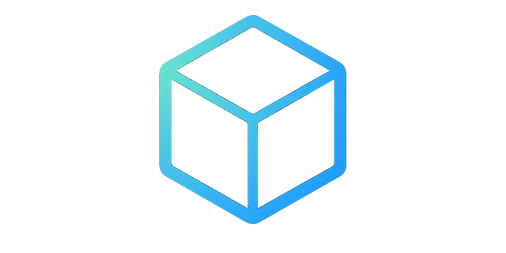
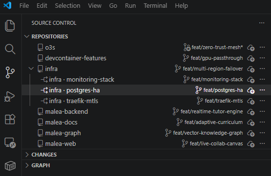
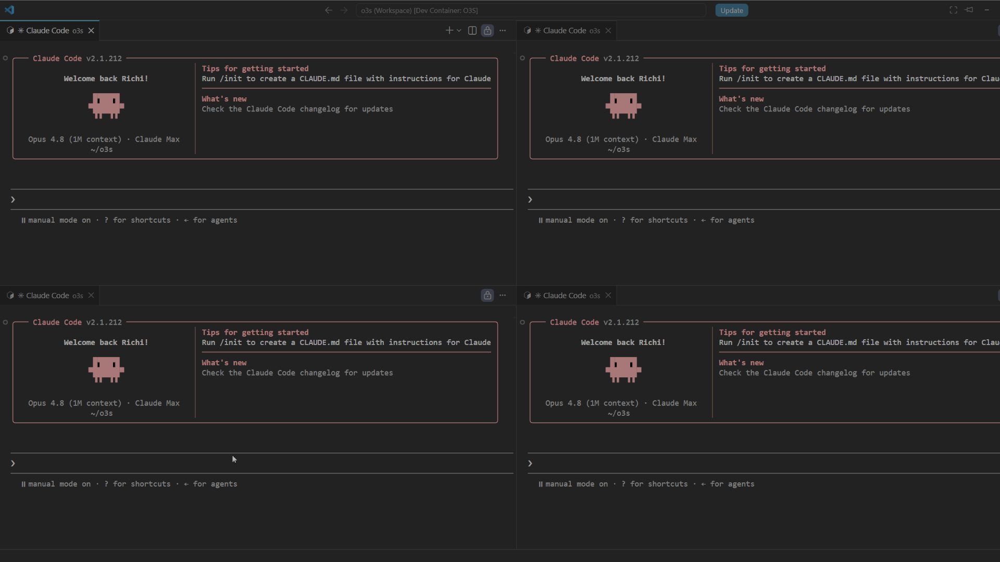

<p align="center">
  
</p>

<h1 align="center">o3s</h1>

<table align="center" width="80%">
  <tr>
    <td width="50%" valign="top" align="center">
      
      <p>Read every line, shape it however you like, and make the whole setup truly your own to trust and extend.</p>
    </td>
    <td width="50%" valign="top" align="center">
      
      <p>Give AI agents and untrusted code a long leash while you control the network they reach and the secrets they read.</p>
    </td>
  </tr>
</table>

<table align="center" width="80%">
  <tr>
    <td width="50%" valign="top" align="center">
      
      <p>Built for engineers and their agents to take your whole stack from prototype to production with minimal friction.</p>
    </td>
    <td width="50%" valign="top" align="center">
      
      <p>Run all your projects at the same time in one workspace while keeping every one of them under your control.</p>
    </td>
  </tr>
</table>

<p align="center"><em>If you have ever asked yourself one of these, o3s might just be for you:</em></p>

## Running several projects at once?

o3s holds them in one workspace. Separate repositories, or one repository on several branches as parallel worktrees, each with its own working tree. Work on many things at once, by hand or with agents, without any of them colliding, all under a single source-control view.

<p align="center">
  
</p>

## How do you trust code you never read?

You cannot read it all: the millions of lines your dependencies drag in, every page an agent fetches, the instruction a prompt injection hides in a file it opens. Any of it can turn on you, and so can a slip of your own hand.

All of it needs the same thing to do real damage: the network. Control that one chokepoint and you cover most of it at once. Every project in o3s sits behind a gateway that denies all egress except an allowlist. You set that list deliberately; nothing running inside the container can touch it. A dependency, an agent, or a wrong command reaches no host you did not name.

<p align="center">
  
</p>

## Would you let AI touch production?

An agent is powerful, production is unforgiving, and the two must never meet. So o3s brings production to the agent. Docker, Kubernetes, your whole stack runs inside the sandbox, where an agent rebuilds it, pen-tests it, and probes it for leaks, giving you evidence instead of a token probability. Breaking is free. Fast cycles are the future, and this is as close as agents and production safely get.

## Getting started

**Prerequisites:** [Docker](https://docs.docker.com/engine/install/), [VS Code](https://code.visualstudio.com/download), and the [Dev Containers extension](https://marketplace.visualstudio.com/items?itemName=ms-vscode-remote.remote-containers).

1. Clone the repo.
   ```bash
   git clone git@github.com:Hansehart/o3s.git
   ```
2. Open it in VS Code and run `Dev Containers: Reopen in Container`.
3. Open `.devcontainer/o3s.code-workspace` and keep your projects in `~/projects`.

> [!TIP]
> Make it yours in the [Customization guide](https://github.com/Hansehart/o3s/wiki/Customization).

> [!WARNING]
> Only `~/features`, `~/o3s`, and `~/projects` survive a rebuild. Keep your work in `~/projects`.
